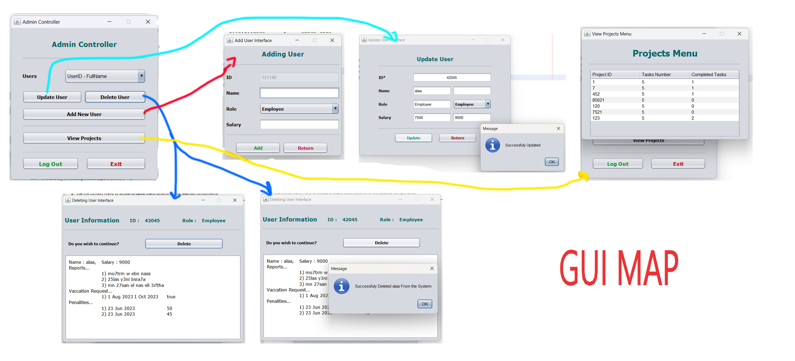

## Project Management System

### It Consists of:-

1. Employee Module
   - Enables employees to enter entry and exit times, to calculate working hours over a month.
   - Enables employees to request vacation.
   - Enables employees to view penalties.
   - Enables employees to view assigned tasks to them over the project.
   - Enables employees to check assigned tasks when finishing them.

2. Team Leader Module
   - Enables leaders to manage employees.
   - Enables leader to assign tasks.
   - Enables leader to view completed tasks.

3. Project Manager Module
   - Enables PM to view the percentage of completion of the project.
   - Enables PM to make reporting to team leader about specific employees.

4. Admin Module
   - Enables admin to view all projects.
   - Enables admin to add/update/delete users with different roles.

5. Controller Module
   - `DataBase` class provides APIs to access and manipulate files.
   - `Authentication` class to provide logging in and registering, extends `DataBase`.
   - `DBTable` class to help set up tables (files), also extends `DataBase`.
   - `DateTime` class provides useful methods related to time and date.
   - `ArrayString` class

### You can download and run it. It supports Windows OS. [Download App](https://raw.githubusercontent.com/AhmedMaherElSaeidi/Project-Management-System/main/assets/App.rar?token=GHSAT0AAAAAACD6ZU7PGTODJB3DXCIPOE6OZEV6K7Q)

### Overview of the app.

  
